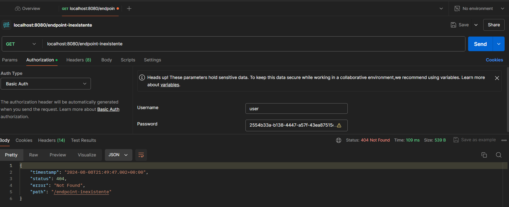

# SpringSecurityOoauth

Nesse repositório serão abordados os seguintes assuntos:

* Entenda os conceitos básicos de autenticação, autorização e proteção de aplicativos da web
* Identificar e avaliar opções de autenticação e autorização
* Proteja uma API REST usando o suporte do servidor de recursos OAuth 2.0 do Spring Security
* Endpoints Spring MVC seguros e consultas Spring Data usando primitivas Spring Security
* Teste seu aplicativo com a segurança habilitada

  # A API Rest sem segurança
  Clone a aplicação, para que façamos algumas observações.

Clone a aplicação desse repositório, em seguida, inicie-a.
Em seguinda, utilizando uma ferramente para requisições Http (Como Postman, HTTPie, ou outra de sua preferência), faça uma requisição conforme segue:
``` bash
GET http://localhost:8080/cashcards
```

Requisições do tipo GET, em aplicações não seguras, ou seja, onde o cabeçalho da requisição, não requer dados de autenticação, também podem ser feitas através de seu navegador:


## Os potencias risco e fragilidades de uma aplicação não segura
Negligenciar a segurança dos endpoints da nossa API tem pelo menos três consequências:

- O conteúdo é *público* – você não pode controlar quem vê as informações
- O conteúdo é *anônimo* – você não pode saber quem está perguntando
- O conteúdo está *desprotegido* - agentes mal-intencionados podem tirar vantagem das vulnerabilidades baseadas no navegador

**Conteúdo Público**
Como o conteúdo é público, qualquer usuário com acesso ao local da rede pode comandar a API e ver os dados. Embora isso possa ser um suavizado com a segurança da rede, na prática, a maioria das APIs REST são frequentemente expostas à Internet pública por meio de navegadores ou gateways de API. Mesmo que não tenham sido expostos à Internet pública, a ameaça real de server-side request forgery (SSRF) deveria nos fazer pensar se estivermos pensando em deixar qualquer uma de nossas APIs de produção abertas dessa forma.

**Conteúdo anônimo**
Como o conteúdo é anônimo, não podemos decidir se o usuário é conhecido, confiável e autorizado. Na prática, também é mais complicado mostrar o conteúdo específico do usuário porque seu identificador não está em nenhum conteúdo da solicitação.

Você acabou de ver esse ponto em ação quando consultou a API pela primeira vez. Mostra o conteúdo dos usuários Sarah e Esuez5; é algo indesejado, do ponto de vista de produção. Mas! Isso pode ser corrigido exigindo autenticação.

**Conteúdo desprotegido**
E como o conteúdo está desprotegido, quando essa API REST é exposta a um navegador, ela pode tornar o aplicativo como um todo vulnerável a CSRF, MITM, XSS e outros ataques sem intervenção adicional.

## Sobre o erro 404s

Para compreensão, com a aplicação rodando, tente fazer uma requisição, em um endpoint que não existe:

``` bash
GET http://localhost:8080/endpoint-nao-existente
```
Um erro 404 será retornado, visto que o endpoint acessado não existe em nossa aplicação.

``` json
{
  "timestamp": "2024-08-08T15:19:19.017+00:00",
  "status": 404,
  "error": "Not Found",
  "path": "/endpoint-nao-existente"
}
```

Esse tipo de resposta, pode acabar servindo como pista, para alguém mal intecionado. Essa é uma vulnerabilidade. Vamos aprofundar mais sobre esses comportamentos enquanto implmentamos a segurança a nossa API.
Aqui estão algumas fontes, para pesquisa de vulnerabilidades: [Fingerprint](https://owasp.org/www-project-web-security-testing-guide/latest/4-Web_Application_Security_Testing/01-Information_Gathering/02-Fingerprint_Web_Server), [Directory Transversal](https://owasp.org/www-community/attacks/Path_Traversal) e [WSTG]([https://owasp.org/www-community/attacks/Path_Traversal](https://owasp.org/www-project-web-security-testing-guide/latest/4-Web_Application_Security_Testing/03-Identity_Management_Testing/04-Testing_for_Account_Enumeration_and_Guessable_User_Account))

# Tornando nossa API Segura
## Segurança padrão (Secure Defaults)
Veremos asseguir alguns padrões do Spring Security e como sobre o princípio de *Segurança por padrão" e "Princípio do menor Privilégio" aos seus aplicativos.

*Secure by Default" ou *Seguro por Padrão*, é um princípio que incentiva você a garantir que suas configurações padrão sejam seguras. Dessa forma, se um aplicativo se encontrar em produção com os padrões de segurança, acaba não sendo vulnerável, por assim dizer.

*O Princípio do Menor Privilégio* é um princípio que incentiva você a pensar em cada fração de dado como um privilégio a ser possuído e a dar aos usuários finais os menores privilégios possíveis para que eles possam fazer bem seu trabalho.

O Spring Security adota ambas as filosofias para proteger automaticamente APIs REST. 

## Padrões de segurança do Spring

Quando o Spring Security está no classpath, o Spring Boot trabalha para configurar seu aplicativo com os seguintes padrões para uma API REST:

- Requer autenticação para todas as solicitações
- Responde com cabeçalhos seguros para todas as solicitações
- Requer mitigação de CSRF para todas as solicitações com efeitos colaterais
- Permite autenticação HTTP Basic com um usuário padrão
- Responde RESTfully a falhas de segurança
- Protege contra solicitações maliciosas com um firewall de aplicativo

Vamos analisar cada um deles de cada vez e relacioná-los aos princípios de Segurança por Padrão e Princípio do Menor Privilégio.

### Requer autenticação para todas as solicitações
Não importa se o endpoint é gerado por você ou pelo Boot, todas as requests em todos os dispatches exigem autenticação.

Independentemente da natureza do endpoint, o Spring Security aplica um Filtro de Servlet que inspeciona cada solicitação e a rejeita se a solicitação não for autenticada.

Este é um dos padrões de segurança do Spring Security.

*Servlets, (Filtros) Filters, and Dispatchers* 

Para entender um pouco melhor, precisamos abordar um pouco da terminologia da API do Servlet.

A API Java Servlet é responsável processar solicitações HTTP dentro de um aplicativo. Usando a terminologia de servlet, uma determinada solicitação HTTP pode passar por vários *dispatches*. Cada dispatch pode ser interceptado por vários *filtros* em seu caminho para um único *servlet*.

Um *servlet* manipula solicitações HTTP e produz uma resposta HTTP. Você fazer a analogia de um *servlet* como um "mini-servidor".

Um *filtro* intercepta requisições HTTP para lidar com preocupações transversais. Normalmente, os filtros enriquecem a requisição de alguma forma ou negam a requisição, impedindo que ela alcance o servlet.

Um *dispach* representa uma única passagem que uma solicitação HTTP faz por um conjunto de filtros e seu servlet de destino. Normalmente, uma solicitação HTTP passa primeiro pelo REQUEST dispatch (despacho), mas também pode passar posteriormente pelo ERROR dispatch, pelo FORWARD dispatch e outros.

Em termos de Spring, o Spring MVC constitui um único servlet, o Spring Security constitui um conjunto de filtros e o Spring Boot é fornecido com um contêiner incorporado que executa os vários *dispatchs* necessários para atender a uma única solicitação.

Tudo isso significa que os padrões do Spring Security exigem que cada *dispatch* seja autenticado.

### Benefícios de segurança
O legal desse arranjo é que não importa quem criou o endpoint. Se for você, Boot ou um terceiro, o filtro de servlet do Spring Security intercepta a solicitação antes que qualquer servlet (um "mini-servidor") possa processá-la.

Isso significa que quando você inclui o Spring Security, mesmo endpoints inexistentes retornarão um código 401 Unauthorized de status de resposta HTTP em vez de, digamos, um 404 Not Found, sendo o 404 resposta padrão do Spring Boot para endpoints inexistentes. O motivo dessa política rigorosa é por causa do *Princípio do Menor Privilégio*. Esse princípio diz que você deve oferecer apenas as informações que o usuário final tem o privilégio de saber.

Qual é o problema? O que há de tão privilegiado em um ponto final inexistente?

Para fins de segurança, até mesmo quais URIs são válidos são informações privilegiadas. Você pode imaginar se alguém solicitasse index.jsp ou /admin . Se o Spring Security retornasse um *404* nesses casos em vez de um *401*, isso significaria *404* que é uma dica para um agente mal-intencionado de que um determinado endpoint existe! O agente mal-intencionado pode usar essa dica para enumerar os URIs válidos das APIs REST, descobrir tecnologias vulneráveis ​​subjacentes e acelerar seu ataque.

### Responde com cabeçalhos seguros para todas as *requests*
Os cabeçalhos HTTP permitem que um cliente e um servidor troquem informações adicionais entre si em uma *request* e *response* HTTP. Seja uma solicitação autenticada ou não, o Spring Security sempre responde com determinados cabeçalhos por padrão. Cada cabeçalho assume como padrão o valor mais seguro disponível.

*Cabeçalhos de cache*
O primeiro são os cabeçalhos de controle de cache. Uma classe de vulnerabilidades baseadas em navegador é que as respostas HTTP são armazenadas em cache no navegador. Por exemplo, suponha que sua API REST retornou o seguinte:
``` json
[
  {
    "amount": 123.45,
    "id": 99,
    "owner": "sarah1"
  },
  {
    "amount": 1.0,
    "id": 100,
    "owner": "sarah1"
  }
]
```

Então essa *response* poderia ser armazenada em cache no navegador para recuperação posterior por um agente mal-intencionado na máquina local do usuário.

O Spring Security aplica configurações seguras para *Cache-Control* e outros cabeçalhos para mitigar essa vulnerabilidade.

***O Cabeçalho Strict Transport Security***
O segundo é o cabeçalho Strict Transport Security. Esse cabeçalho força um navegador a atualizar solicitações para HTTPS por um período de tempo especificado.

OBSERVAÇÃO: Como isso é destinado a *requests* HTTPS, ele não é escrito por padrão para uma *request* HTTP. Considerando isso, você pode não vê-lo em seus testes locais sobre HTTP.

Há muito tempo o HTTPS tem se mostrado um componente crítico de implantações seguras. Ataques man-in-the-middle tornam possível que os dados que passam entre o usuário final e a API REST sejam visualizados e modificados.

Tais ataques são mitigados por HTTPS, e o cabeçalho Strict Transport Security informa ao navegador para não enviar nenhuma solicitação para esta REST API por HTTP. Em vez disso, qualquer solicitação HTTP deve ser automaticamente atualizada pelo navegador para HTTPS.

**Opções de tipo de conteúdo**
O terceiro e último cabeçalho sobre o qual falaremos neste ponto é o cabeçalho X-Content-Type-Options. Este cabeçalho diz aos navegadores para não tentarem adivinhar o tipo de conteúdo de uma resposta.

Um lugar comum onde atores mal-intencionados se escondem é onde o protocolo HTTP é confuso e os aplicativos tentam entender, e adivinhar a intenção da *request* ou *response*. Um navegador, por exemplo, pode olhar para uma resposta que começa com <html> e tentar adivinhar que o tipo de conteúdo é text/html– ou seja, uma página da web. Às vezes, essa suposição não é segura. Por exemplo, é possível que uma imagem contenha conteúdo de script e o navegador pode ser enganado para adivinhar e executar steal-my-password.jpgccomo JavaScript.

O Spring Security resolve isso emitindo uma configuração segura *X-Content-Type-Options* por padrão.

###  Requer mitigação de CSRF para todas as solicitações com efeitos colaterais
Outro ponto em que as APIs REST correm risco é a capacidade de sites de terceiros fazerem solicitações a elas sem o consentimento do usuário.

Isso é possível porque os navegadores, por padrão, enviam todos os cookies e detalhes de autenticação HTTP Basic automaticamente para qualquer endpoint não XHR.

Por exemplo, dê uma olhada nesta *request* de uma suposta imagem:
´´´ html

´´´
Essa solicitação será executada pelo navegador. Isso funciona porque o navegador não tem como saber se a URL aponta para uma imagem até que a resposta retorne. A essa altura, o dano já foi feito.

Como você pode imaginar, os navegadores até fazem essa solicitação em sites de terceiros. Os navegadores, por padrão, enviarão todos os cookies do *mybank.example.org*  e credenciais HTTP Basic para ele também por padrão. Isso significa que, se seu usuário estiver logado, um aplicativo de terceiros pode comandar sua API REST sem proteção adicional.

Por isso, o Spring Security protege automaticamente esses endpoints com efeitos colaterais, como POSTs, PUTs e DELETEs. Ele faz isso enviando um token especial para o cliente que ele deve usar em solicitações subsequentes. O token é transmitido de tal forma que terceiros não podem vê-lo. Então, quando o token é retornado, o Spring Security acredita que ele é legitimamente do cliente.

### Permite autenticação básica HTTP com um usuário padrão
O Spring Security gera um usuário padrão chamado user. Sua senha é gerada, no entanto, em cada inicialização.

O motivo para isso é que, se você acidentalmente implantar os padrões do Spring Security para produção, ninguém poderá usar o nome de usuário e a senha padrão para comandar seu aplicativo. Esta é outra instância clássica de criação de um aplicativo que é *Secure By Default* ou, um aplicativo cujas configurações padrão são seguras.

A senha do usuário: *user* pode ser encontrada no logo de inicialização da aplicação:
``` bash
Using generated security password: fc7e0357-7d82-4a9c-bae7-798887f7d3b3
```
O UUID nessa string é a senha. Ele será diferente para cada vez que o aplicativo for iniciado.

Conforme declarado, o Spring Security, por padrão, aceitará esse nome de usuário e senha usando o padrão de autenticação HTTP Basic, como veremos em seguida:

### Responde RESTfully a falhas de segurança
O Spring Security responde com um código de status "401 Unauthorized" quando as credenciais estão erradas ou ausentes na solicitação. Ele também, por padrão, enviará os cabeçalhos apropriados para indicar o tipo de autenticação esperado. O significado implícito do "401" é que a solicitação não é autenticada .

Ele responde com um código de status "403 Forbidden" quando as credenciais são boas, mas a solicitação não é autorizada, como quando um usuário final tenta executar uma solicitação somente de administrador. O significado implícito do 403 é que a solicitação não é autorizada.

### Protege contra solicitações maliciosas com um firewall de aplicativo
Há inúmeras outras maneiras pelas quais um agente mal-intencionado pode tentar fazer mau uso da sua API REST. Com muitas delas, a melhor prática é rejeitar a solicitação imediatamente.

O Spring Security ajuda você com isso adicionando um firewall de aplicativo que, por padrão, rejeita solicitações que contêm codificação dupla e vários caracteres inseguros, como retornos de carro e quebras de linha. Usar o firewall do Spring Security ajuda a mitigar classes inteiras de vulnerabilidades.

# Prática 1 - Tornando a Aplicação Segura com a Segurança Padrão (Security´s Defaults)
Nessa prática, adicionaremos o Spring Security ao projeto desse repositório e vamos explorar como é a proteção padrão, fornecida pelo Spring Security.

No projeto inicial, adicionar a dependência do Spring Security no arquivo pom.xml, conforme segue:

``` xml
      <dependencies>
        ...
        <dependency>
            <groupId>org.springframework.boot</groupId>
            <artifactId>spring-boot-starter-security</artifactId>
        </dependency>
        ...
      </dependencies>
```

Dessa forma o Spring Security é adicionando ao *classpath*, e a autoconfiguração é feita pelo Spring Boot.
Em seguida, rode os teste da aplicação. No terminal, digite:
``` bash
> mvn tests
```

```
[ERROR]   CashCardApplicationTests.shouldCreateANewCashCard:44 Status expected:<201> but was:<403>
[ERROR]   CashCardApplicationTests.shouldReturnACashCardWhenDataIsSaved:28 Status expected:<200> but was:<401>
[ERROR]   CashCardApplicationTests.shouldReturnAllCashCardsWhenListIsRequested:57 Status expected:<200> but was:<401>
```
Os testes falharam, somente pela adição do security ao classpath. Isso devido a segurança padrão *(secure by default)* do Spring Security.

### Requer Autenticação para Todas Requests
Conforme visto anteriormente, o Spring Security requer autenticação para todos os endpoints por padrão. É por isso que os testes estão falhando, relatando que um 401 ao invés vez do código de status esperado.

Para alterar os testes para fornecer autenticação serão necessários dois passos.
1 - Confirmar que a dependência de testes, do Spring Security está adicionada ao pom.xml
``` xml
</dependencies>
    ...
    <dependency>
            <groupId>org.springframework.security</groupId>
            <artifactId>spring-security-test</artifactId>
            <scope>test</scope>
        </dependency>
    ...
    </dependencies>
```

2 - Utilizar a anotação *@WithMockUser* no testes

A dependencia de testes do Spring Security, fornece a possibilidade de simular um usuário, ou *principal*, como se ele estivesse autenticado durante os testes.

Adicione a anotação *@WithMockUser* no topo da classe de testes *CashCardApplicationTests*
``` java
import org.springframework.security.test.context.support.WithMockUser;
...
@SpringBootTest
@AutoConfiguredMockMvc
@WithMockUser
public class CashCardApplicationTests {
 ...
```

Dessa forma o Spring Boot ira simular um usuário *user* para cada teste. Dessa forma, pode-se confirmar que a segurança da API está configurada corretamente.

Após modificar a classe de testes, execute os testes novamente:
``` bash
> mvn tests
```

``` bash
[ERROR] Tests run: 3, Failures: 1, Errors: 0, Skipped: 0, Time elapsed: 5.474 s <<< FAILURE! -- in example.cashcardoauth2.CashCardApplicationTests
[ERROR] example.cashcardoauth2.CashCardApplicationTests.shouldCreateANewCashCard -- Time elapsed: 0.023 s <<< FAILURE!
java.lang.AssertionError: Status expected:<201> but was:<403>
```

O teste *shouldCreateANewCashCard* que testa a criação de um novo cartão de crédito falhou, mas esse comportamento para uma requisição do tipo POST, era esperado.

### Requer CSRF para Todas as Solicitações com Efeitos Colaterais

Como visto, os testes passaram exceto o *shouldCreateANewCashCard*, que é um teste POST que cria um novo CashCard. Isso ocorre porque o Spring Security não autoriza POSTs sem um token CSRF.

É possívl adicionar isso na declaração MockMvc usando um dos MockMvc RequestPostProcessors do Spring Security, ou seja, csrf().

Para corrigir o teste com suporte CSRF, importe o método auxiliar estático e adicione o token CSRF à solicitação:

Primeiro, importe o método estático
``` java
import static org.springframework.security.test.web.servlet.request.SecurityMockMvcRequestPostProcessors.csrf;
...
void shouldCreateANewCashCard() throws Exception {
  String location = this.mvc.perform(post("/cashcards")
      .with(csrf())
   ...
```
Rodando os testes novamente, agora os 3 deverão passar.

### Requer Autenticação para todas As Requisições (Requests)

Vamos fazer uma requisição http: no endpoint */Cashcards*:
  - Inicie a aplicação através de sua IDE ou do terminal:
``` bash
> mvn spring-boot:run
```
  - Faça uma requisição a aplicação utlizando sua ferramenta preferida (Postman, HTTPie, etc), como segue:
``` bash
GET http://localhost:8080/cashcards
```
Caso esteja utilizando o HTTPie, interrogue conforme segue:
``` bash
http :8080/cashcards
```
O retorno deverá ser:
```
HTTP/1.1 401 
Vary: Origin
Vary: Access-Control-Request-Method
Vary: Access-Control-Request-Headers
Set-Cookie: JSESSIONID=CFD6DB8E3CCBBF61B4690CBCB2262C92; Path=/; HttpOnly
WWW-Authenticate: Basic realm="Realm"
X-Content-Type-Options: nosniff
X-XSS-Protection: 0
Cache-Control: no-cache, no-store, max-age=0, must-revalidate
Pragma: no-cache
Expires: 0
X-Frame-Options: DENY
Content-Length: 0
Date: Thu, 08 Aug 2024 18:36:25 GMT

<Response body is empty>

Response code: 401; Time: 35ms (35 ms); Content length: 0 bytes (0 B)
```  
Ao invés de obtermos as informações dos cartões de crédito, recebemos um código 401.
Isso ocorre, devido ao Spring Security, requerer autenticação para qualquer requisiçao feita a nossa aplicação Spring Boot.

Nota: Como abordado anteriormente, o Spring Security usa convenções REST ao responder a falhas de segurança: 401 para erros de autenticação, 403 para erros de autorização.

Para compreender isso ainda mais, agora tente um endpoint inexistente como este:
``` bash
GET http://localhost:8080/endpoint-nao-existente
```
Caso esteja utilizando o HTTPie, interrogue conforme segue:
``` bash
http :8080/endpoint-nao-existente
```
O retorno deverá ser:
``` bash
http :8080/endpoint-nao-existente
HTTP/1.1 401
Cache-Control: no-cache, no-store, max-age=0, must-revalidate
```
Pode-se notar que agora, obtivemos um código 401, ao invés do código 404 que obtinhamos, antes da aplicação ter sido protegida. Essa estratégia é defensiva, para que informação protegida não seja compartilhada de forma publica.

### Verifique os cabeçalhos
Anteriormente vimos que o Spring Security "Responde com Cabeçalhos Seguros para Todas as Requisições". Podemos ver esse princípio em ação em nossos testes recém executados.
``` bash
...
Cache-Control: no-cache, no-store, max-age=0, must-revalidate
...
X-Content-Type-Options: nosniff
X-Frame-Options: DENY
```

#Prática 2 - Utilizando HTTP Basic e o Usuário Padrão:

Localize a senha padrão, fornecida no log da aplicação Spring Boot:

Interrogue a aplicação, agora passando as credenciais:
```bash
http -a user:6cc833e4-... :8080/cashcards
```
Caso esteja utilizando Postman, configure a requisição conforme segue:


A resposta deverá conter os cartões de crédito:

``` bash
http -a user:722a6428-d501-4a91-9785-5276835890d1 :8080/cashcards
HTTP/1.1 200 
Cache-Control: no-cache, no-store, max-age=0, must-revalidate
Connection: keep-alive
Content-Type: application/json
Date: Thu, 08 Aug 2024 19:10:11 GMT
Expires: 0
Keep-Alive: timeout=60
Pragma: no-cache
Transfer-Encoding: chunked
Vary: Origin
Vary: Access-Control-Request-Method
Vary: Access-Control-Request-Headers
X-Content-Type-Options: nosniff
X-Frame-Options: DENY
X-XSS-Protection: 0

[
    {
        "amount": 123.45,
        "id": 99,
        "owner": "sarah1"
    },
    {
        "amount": 1.0,
        "id": 100,
        "owner": "sarah1"
    },
    {
        "amount": 150.0,
        "id": 101,
        "owner": "esuez5"
    }
]
```
Feito isso, novamente, interrogue a aplicação, agora passando as credenciais agora com um endpoint que não exista:
``` bash
http -a user:6cc833e4-... :8080/endpoint-inexistente
```
Interrogando via Postman:
